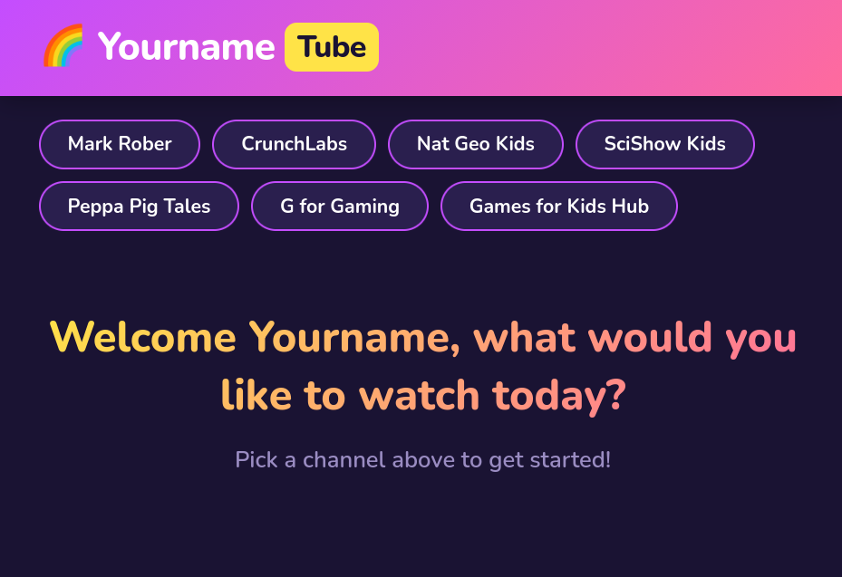

# KidTube

Kid-focused YouTube frontend. Curated channels, no Shorts, simple UI. Uses Invidious for catalog and playback; falls back to yt-dlp stream proxy when Invidious can't serve a video.

## Requirements

- Docker & Docker Compose
- Invidious instance URL

## Setup

1. Copy `config.yaml.example` to `config.yaml`
2. Edit `config.yaml`: set `invidious_url`, `kid_name`, and your `channels`
3. Run: `docker compose up -d`

App listens on port 8080. Use Caddy or nginx in front for TLS if needed.

## Config

- `invidious_url` – Your Invidious instance (e.g. `https://invidious.example`)
- `kid_name` – Used in the logo/title (e.g. YournameTube) and welcome message
- `channels` – List of channels or playlists. Use `id` for channel (UC... or @handle), or `playlists` for multiple playlists with optional `max_duration_seconds`
- `max_duration_seconds` - Can be used to filter out hours-long compilation videos, no one needs those
- `min_duration_seconds` – Filters out Shorts (default 60)
- `videos_per_channel` – Max videos shown per channel (default 120)

## AI use
This was built with AI assistance (Cursor and Composer 1.5)
